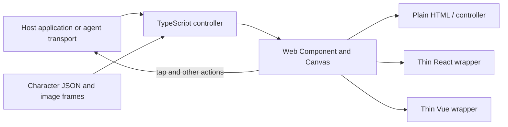

# Why this stack

The requirement is one portable sprite companion for plain pages, React and
Vue, with different characters and host-defined agent behavior.

| Choice | Reason | Tradeoff |
| --- | --- | --- |
| TypeScript core | Typed commands/events without requiring a framework or DOM | Host owns agent transport and business state |
| Web Components | A shared browser element that works in all target hosts | Framework wrappers simplify lifecycle and prop handling |
| Shadow DOM | Prevent host styles from accidentally changing the character UI | Customization uses CSS properties, parts, or the host's own surrounding UI |
| Canvas 2D | Draw variable atlas rectangles and separate frames with one renderer | Pixels are not semantic HTML; labels, button and text bubble provide accessibility |
| JSON character packs | New figures and arbitrary reaction names are data | Static images must be served at known URLs; bundlers do not all copy asset directories automatically |
| esbuild + tsc | Small ESM/global distributions with declarations | Build/runtime paths need real installed-consumer tests |
| Python + browser rasterizer | Deterministic source cels matching the original SVG style | An artwork production tool, not a runtime requirement |

An all-React implementation would require a React runtime in the controller
and Vue consumers. Separate framework implementations would duplicate the
player and its bugs. This project therefore shares a framework-free element
and keeps optional wrappers small.

For the current sprites requirement, this stack is sufficient. Rive would be
worth evaluating for continuous vector/bone animation, blending or designer
state machines; it requires a different authoring workflow and runtime. PixiJS
would be useful for a scene with many actors/effects. Neither is needed for a
single lightweight sprite companion. Native mobile/desktop UI without a browser
is outside this web component's scope; a WebView or separate renderer would be
required, while the pack format and controller concepts could be reused.

The complete global browser JS bundle is about 14 KB minified before gzip,
excluding character images. The studio is larger because it intentionally
loads both React and Vue to demonstrate interoperability. A plain controller
page does not load either framework.
